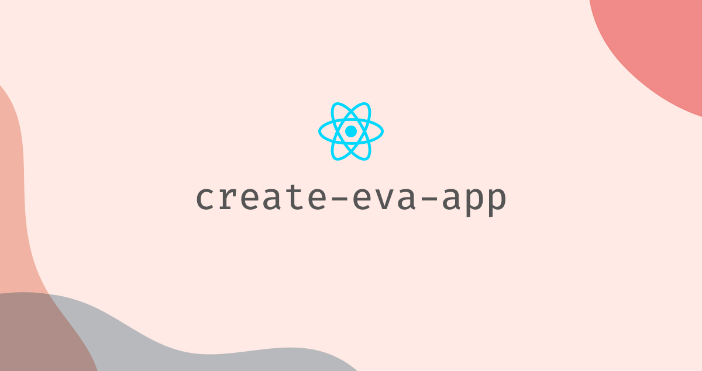

<div align="center">
  
</div>

[](https://oclif.io)
[](https://npmjs.org/package/create-eva-app)
[](https://github.com/eva-tech/create-eva-app/blob/master/package.json)

<p align="center">
  <b>Set up an Eva-Ready web or mobile app by running one command 💖</b>
</p>

<br>

## 👨‍💻 Usage

Using **npx**:

```sh
npx create-eva-app
```

Without **npx**:

```sh
npm i -g create-eva-app
create-eva-app
```

That's all! 😄
